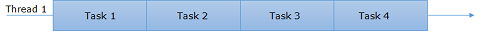
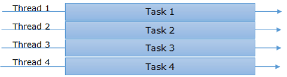
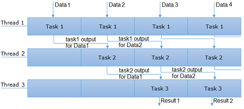

# Parallels

Implementation of the Parallels project.

The russian version of the task can be found in the repository.

## Contents

1. [Chapter I](#chapter-i) \
   1.1. [Introduction](#introduction)
2. [Chapter II](#chapter-ii) \
   2.1. [Multithreading](#multithreading) \
   2.2. [Mutexes](#mutexes) \
   2.3. [Pipeline parallelism](#pipeline-parallelism)
3. [Chapter III](#chapter-iii) \
   3.1. [Part 1](#part-1-ant-colony-optimization-algorithm-(ACO))  \
   3.2. [Part 2](#part-2-solving-systems-of-linear-equations-(SLE))  \
   3.3. [Part 3](#part-3-winograd-algorithm)

## Chapter I  

Chuck sat down at the table with such force that the coffee almost spilled out of the cup.

"You won't believe what I just heard from the IS guy," he began, looking around for a waiter. This cafe was a place the two of them had loved since college. Not crowded, with delicious coffee and desserts. And most importantly, it was always quiet and peaceful. Perfect for doing your thing, working or studying, something Eve was doing right now. She had long been interested in multithreading and paralleling algorithms. And now she had finally found the time to study them properly. 

"So, our 'geniuses' upstairs managed to lose a dangerous, super-smart artificial intelligence," Chuck began to whisper. "I don't know what kind of assassin vacuum cleaner they made it for, but everyone seems to be panicking. I heard Bob's not himself."

"Sounds serious," Eve said, breaking away from her task. "I heard something like that too, but Bob didn't seem too scared. And how do you lose artificial intelligence? It's not like it fell out of the bag."

"God knows. What if it ran off on its own? Anyway, it all looks very dirty.  Have you seen our financial statements? I work with them. And they don't look good for investing in some innovative robots. I'm telling you, they're secretly building the Terminator."

"Oh, come on," Eve said thoughtfully.

"You'll see," Chuck replied distractedly. "So, what did you order? Mmm, smells good..."

## Introduction

In this project, you will learn the basic approaches to parallelism, and implement some algorithms applying it.

## Chapter II

### Multithreading

**Synchronous programming** is a programming model in which each thread has a set of tasks. All tasks within the thread are executed sequentially, and when one task is completed, it is possible to do another one. In this model, you can't stop the execution of one task to do another in between.

A special case of synchronous programming is *single-threading*.  If there are multiple tasks to be executed, and the current system provides a thread that can handle all of them, then they are executed one at a time, and the process looks like this:

Here you can see that there is one thread and 4 tasks to execute. The thread starts to execute them one at a time and eventually completes them all.

In cases where the order in which the tasks are executed does not affect the result of the program, *Multithreading* can be used.

Multithreading is another case of the synchronous programming where there are many threads that can take tasks and start working on them, i.e. we have thread pools and many tasks. \
So, multithreading can work like this:

Here you can see that we have 4 threads and just as many tasks to execute, and each thread starts working on them. This is a perfect case, but under normal conditions more tasks are used than the number of threads available, so the free thread gets another task. \
Creating new threads each time is not advisable, because it requires the use of additional system resources such as CPU time and memory. Therefore, the initial number of threads should be set in advance.

### Mutexes

When writing multithreaded applications, it is almost always necessary to work with shared data, which can have very unpleasant consequences if they are modified at the same time.
To protect shared data from concurrent access, you need to use *synchronization objects*.

**Mutex** is a mutually exclusive synchronization object. This means that the thread can only receive it one at a time. Mutex is designed for situations where a shared resource can only be used in one of the threads at a time.
For example, the system log is shared among several processes, but only one of them can write data to the log file at any given time. The mutex is perfect for synchronizing these processes.

Only one bit is needed to describe a mutex, although it is more common to use an integer variable, where 0 is the unlocked state and all other values correspond to the locked state.

The mutex value is set by two procedures: acquire and release.

1. When a thread is about to enter a critical section, it calls the acquire procedure.
2. If the mutex is unlocked, the request is executed and the calling thread can enter the critical section.
3. If the mutex is locked, the thread trying to enter the critical section is locked.
4. When the thread is about to leave the critical section, it calls the release procedure.

The principles of working with mutexes differ between Windows and Linux, but we can highlight the following general steps:
- create/describe,
- open/initialize,
- acquire and wait,
- release.

### Pipeline parallelism

The classic way to use multithreading, in the case where you need to solve the same problem for some *N* sets of input data, is to run the entire algorithm in one thread. 
In this approach, each thread executes the algorithm for *N/(number_of_threads)* sets of input data.

**Pipelining** is generally based on dividing the algorithm to be executed into smaller parts, called stages, and assigning a separate thread to each of them. In this way, the processing of an arbitrary set of data can be divided into several stages, and the transfer of data from one stage to the next can be organized. Performance increases in this case because different sets of data are processed simultaneously in different stages (in different threads) of the pipeline.

An example of how the pipeline is organized:

The example is the algorithm for finding the largest number in a string.
The input is an array of strings that we want to search for.
The first thread will split the string into words, the second will convert the words to a numeric data type, and the third will search for the largest among the numbers.
The work process will look like this:
1. The first thread processes the first string in the array. The others wait for their turn.
2. The array of words obtained after processing the first string goes to the second thread. Since the first thread is free, it gets the second string to process.
3. Then the switching between threads 2 and 3 is done in the same way as between threads 1 and 2.
4. If the 2nd string in the 1st thread is processed faster than the 1st string in the 2nd thread, the 2nd string enters the queue and waits for the 2nd thread to become free. In the meantime, since the first thread is free, it receives the 3rd string for processing.

## Chapter III

## Part 1. Ant colony optimization algorithm (ACO)

You need to implement an ACO algorithm to solve the traveling salesman problem from the *A2_SimpleNavigator* project with and without parallel computing:
- The program must be developed in C++ language of C++17 standard.
- The program code must be located in the src folder.
- When writing code it is necessary to follow the Google style.
- Do not use outdated language constructs and libraries.
- Provide a Makefile for building the program (with targets all, clean, ant).
- The program must have a console interface.
- The user sets the matrix for the traveling salesman problem.
- The user sets the number of executions *N*.
- Display the results of each of the algorithms for the specified matrix.
- Measure the time it takes to execute *N* times an ACO algorithm applying parallelism for a user-defined matrix.
- Measure the time it takes to execute *N* times the usual ant algorithm for a user-defined matrix.
- Display the obtained time.
- Use mutexes to lock access to data for parallel implementation.

## Part 2. Solving systems of linear equations (SLE)

You need to implement the usual and parallel algorithms to solve the SLE using the Gaussian elimination method:
- The program must be developed in C++ language of C++17 standard.
- The program code must be located in the src folder.
- When writing code it is necessary to follow the Google style.
- Do not use outdated language constructs and libraries.
- Add to an existing Makefile target called "gauss" for building the program.
- The program must have a console interface.
- The user sets the matrix describing the SLE.
- The user sets the number of executions *N*.
- Display the results of each of the algorithms for the specified SLE.
- Measure the time it takes to execute *N* times a parallel algorithm for solving a user-defined SLE.
- Measure the time it takes to execute *N* times the usual algorithm for solving a user-defined SLE.
- Display the obtained time.
- Use mutexes to lock access to data for parallel implementation.

## Part 3. Winograd algorithm

You need to implement the Winograd algorithm of matrix multiplication without using parallelism, as well as using pipeline and classical methods of parallelism:
- The program must be developed in C++ language of C++17 standard.
- The program code must be located in the src folder.
- When writing code it is necessary to follow the Google style.
- Do not use outdated language constructs and libraries.
- Add to an existing Makefile target called "winograd" for building the program.
- There should be four stages of the pipeline work.
- The program must have a console interface.
- There should be two ways of entering:
    - The user sets both matrices for multiplication;
    - The user sets dimensions of the matrices, which are then filled into the program randomly.
- The user sets the number of executions *N*.
- Display the results of each of the algorithms as well as the generated matrices.
- Measure the time it takes to execute *N* times matrix multiplication without using parallelism.
- Measure the time it takes to execute *N* times matrix multiplication using classical parallelism with the number of threads equal to 2, 4, 8, ..., 4 * (number of logical computer processors).
- Measure the time it takes to execute *N* times matrix multiplication using pipeline parallelism.
- Display the obtained time.
- Use mutexes to lock access to data for parallel implementation.

💡 [Tap here](https://forms.yandex.ru/cloud/64181e44d0468826e3eb4a68/) **to leave your feedback on the project**. Our team really tries to make your educational experience better.
